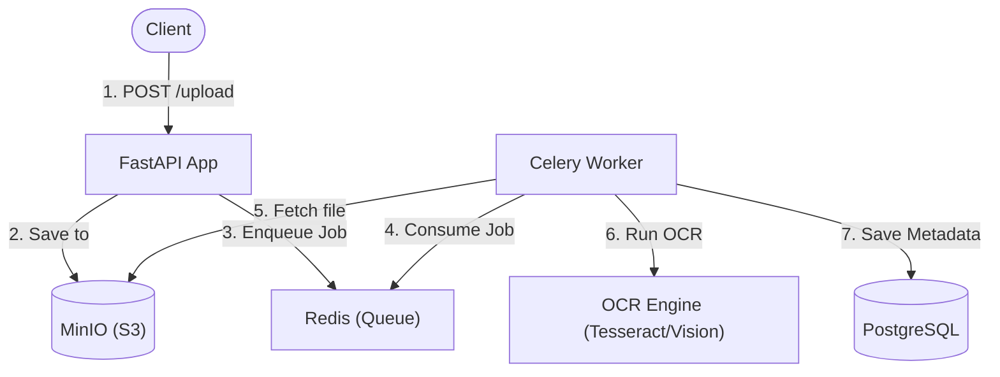

# Architecture — document-processor-ocr
> Last updated: 2026-08-29 | Maturity: Partial Prototype
> _OCR document processing with FastAPI and Celery._

## System Diagram

## Component Table
| Component | File | Responsibility | Tech |
|---|---|---|---|
| API | `api/` | Ingests documents | FastAPI |
| Worker | `doc_queue/` | Async processing | Celery |
| Storage | `storage/` | MinIO interface | Python |
| Database | `docker-compose.yml`| RDBMS for states | PostgreSQL |

## Dependency Honesty Table
| Dependency | Status | Notes |
|---|---|---|
| Postgres | **Real** | Used for metadata and job status. |
| MinIO | **Real** | Used as S3-compatible storage. |
| OCR Engine | **Mocked** | Simulated with a fixture for fast CI execution. |
